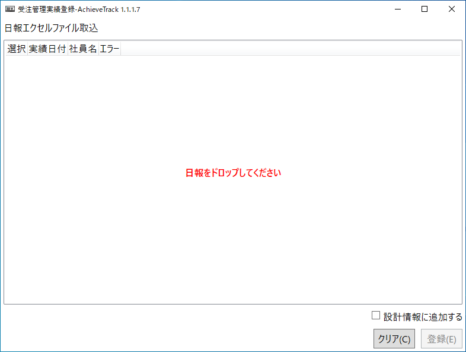
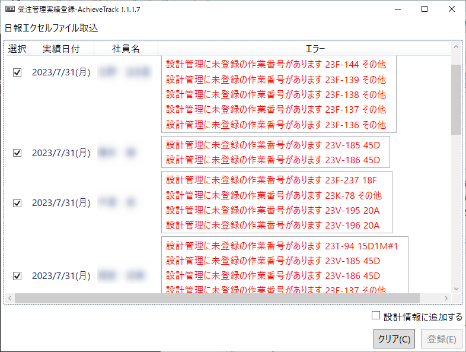
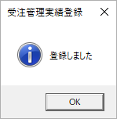

# 受注管理実績登録

AchieveTrack

- [1. 使用方法](#1-使用方法)
- [2. エラーメッセージ内容](#2-エラーメッセージ内容)
- [3. 技術情報](#3-技術情報)

## 1. 使用方法

1. アプリケーションを起動します。

   

2. 受注管理日報エクセルファイルをドラッグ＆ドロップします。
3. 日報の内容が表示されます。

   

   1. エラーが表示されている場合は、エラー内容を解消してください。

4. 「登録」ボタンをクリックします。

   - 設計部専用の機能として、登録の際に「設計情報に追加する」にチェックを入れると、設計情報に追加されます。
     その際、設計管理未登録のエラーは無視されます。

5. 登録完了のメッセージが表示されます。

   

## 2. エラーメッセージ内容

| メッセージ                                                  | 内容                                                   | 対処方法                                                                                                                                 |
| ----------------------------------------------------------- | ------------------------------------------------------ | ---------------------------------------------------------------------------------------------------------------------------------------- |
| この作業日と社員番号の組み合わせが 実績処理で既に存在します | 受注管理に作業日と社員の組み合わせで受注管理に登録済み | このアプリケーションは、受注管理の内容の上書きはしていません。必要に応じて、受注管理の機能で、既存の実績を削除してから登録してください。 |
| 作業台帳にない作業番号です                                  | 作業番号が受注管理に登録されていない                   | 工数転送システムで、作業番号を間違えたと思われます。確認して再転送してください。                                                         |
| 設計管理に未登録の作業番号です                              | 作業番号が設計情報に登録されていない                   | 作業番号が間違いないことを確認して、設計情報に追加するチェックを入れて登録してください。                                                 |
| 作業日が完成を過ぎています                                  | 作業日が完成日を過ぎている                             | 工数転送システムで、作業番号を間違えたと思われます。確認して再転送してください。                                                         |

## 3. 技術情報

